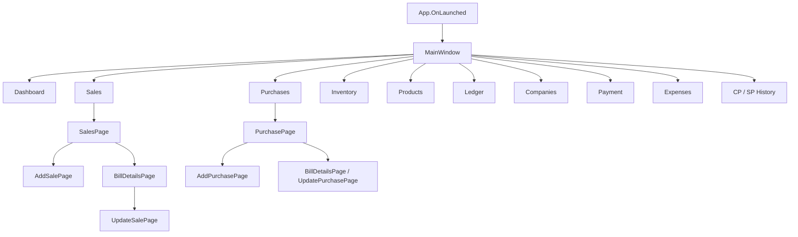
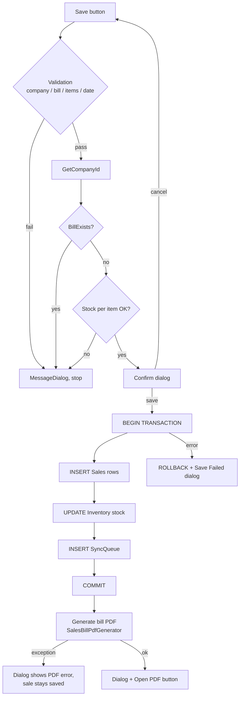

# National Agro Trading — Debugging Guide

> Applies to the WinUI desktop app (`NationalAgroTrading.WinUI`, .NET 8, Windows App SDK).
> Database: SQLite at `D:\National Software\natdatabase.db`
> Generated bills: `D:\National Software\Sales Bills\`

---

## 1. Application map (navigation flowchart)

```
App.OnLaunched
  └── MainWindow (sidebar + MainFrame)
        ├── Dashboard ............ DashboardPage
        ├── Sales ................ SalesPage ──► BillDetailsPage ──► UpdateSalePage
        │                          └──────────► AddSalePage ──(save)──► PDF auto-generate
        ├── Purchases ............ PurchasePage ──► BillDetailsPage / AddPurchasePage / UpdatePurchasePage
        ├── Inventory ............ InventoryPage ──► UpdateInventoryPage / AddProductPage
        ├── Add Product .......... ProductPage ──► AddProductPage / UpdateProductPage
        ├── Ledger ............... LedgerPage ──► OpeningBalancePage  (+ Excel/PDF export)
        ├── Companies ............ CompanyPage ──► AddCompanyPage / EditCompanyPage
        ├── Payment .............. PaymentPage ──► AddPaymentPage / UpdatePaymentPage
        ├── Expenses ............. ExpensesPage (Excel export)
        ├── CP History ........... CostPriceHistoryPage
        └── SP History ........... SalesPriceHistoryPage
        (Counter Sales button: title set only — no page navigation yet)
```

Mermaid version (renders on GitHub / VS Code Mermaid extension):



---

## 2. Core flow: Add Sale → DB → PDF (primary debug target)

```
┌─────────────────────────────────────────────────────────────────────────────┐
│ AddSalePage.SaveSaleAsync()                                                 │
│                                                                             │
│  1. Validate company / bill no / items / discount / Nepali date             │
│  2. GetCompanyId(companyName)            → -1 = not found                   │
│  3. BillExists(companyId, billNumber)    → blocks duplicates ("Bill <n>")   │
│  4. Per item: ProductID valid, qty > stock check                           │
│  5. Confirmation dialog (Subtotal / Grand Total preview)                    │
│  6. BEGIN TRANSACTION                                                       │
│       a. per item: re-check stock inside transaction                        │
│       b. per item: INSERT Sales row (13 cols, incl. VAT math)               │
│       c. per item: UPDATE Inventory SET TotalStockLeft -= qty               │
│       d. per item: INSERT SyncQueue ('Sales', RowId, 'INSERT', Synced=0)    │
│     COMMIT  (any failure → ROLLBACK + "Save Failed" dialog)                 │
│  7. SalesBillPdfGenerator.GenerateBillPdfAsync(...)   ← NEW                 │
│       ├─ totals recomputed with SAME rules (proportional discount,          │
│       │  VAT 13% only on vattable items after discount)                     │
│       ├─ buyer info loaded from Company table                               │
│       └─ writes "Bill <n> - <Company>.pdf" to D:\National Software\          │
│            Sales Bills\  (falls back to Documents\National Agro Trading\     │
│            Sales Bills\ if D: is unavailable)                               │
│     PDF failure does NOT fail the sale — error shown in dialog only         │
│  8. "Sale Saved" dialog → [Open PDF] launches default viewer                │
└─────────────────────────────────────────────────────────────────────────────┘
```



### VAT rule (memorize this before debugging totals)

Bill-level discount `D%` is spread across items **proportionally to each item's
subtotal**, then VAT 13% is charged **only on vattable items, on their
after-discount amount**:

```
subtotal        = Σ (qty × price)
totalDiscount   = subtotal × D% / 100
itemDiscount_i  = subtotal_i / subtotal × totalDiscount
vat             = Σ over vattable items of (subtotal_i − itemDiscount_i) × 0.13
grandTotal      = subtotal − totalDiscount + vat
```

The PDF generator (`SalesBillPdfGenerator.CalculateVat`) and the save path
(`AddSalePage` item loop) implement this identically. A bill mixing VAT and
non-VAT products will therefore show VAT < 13% of the taxable amount — that is
correct, not a bug.

---

## 3. Live diagnostic outputs (run 2026-09-07 against your database)

Run any of these with **DB Browser for SQLite** (open
`D:\National Software\natdatabase.db`, Execute SQL tab), or `py` + `sqlite3`.

### 3.1 Health summary — actual current state

| Table | Rows | | Table | Rows |
|---|---|---|---|---|
| Company | 21 | | Product | 32 |
| Sales | 155 | | Inventory | 31 |
| Purchase | 40 | | Ledger | 43 |
| SyncQueue | 9 | | Customer | 9 |

### 3.2 Duplicate bill numbers (42 groups) — **legacy data, not an active bug**

```sql
SELECT CompanyID, BillNumber, COUNT(*) c
FROM Sales WHERE CompanyID IS NOT NULL
GROUP BY CompanyID, BillNumber HAVING c > 1
ORDER BY c DESC;
```

All duplicates are dated **2025-06/07** (before the `BillExists` guard was
added); today's saves go through the check. Examples: company 8 has
`Bill 1` ×7, `Bill 061665` ×2. Current code prevents new ones.

### 3.3 VAT mismatches in stored rows (17 bills) — **legacy formula**

```sql
WITH bill AS (
  SELECT BillNumber, CompanyID,
         SUM(TotalSalesAmount) sub,
         SUM(DPercentage * TotalSalesAmount / 100.0) disc
  FROM Sales WHERE CompanyID IS NOT NULL
  GROUP BY BillNumber, CompanyID)
SELECT s.BillNumber,
       ROUND(SUM(s.VATAmount),2)  stored_vat,
       ROUND(SUM(CASE WHEN p.IsVattable=1
                      THEN (s.TotalSalesAmount - s.TotalSalesAmount/b.sub*b.disc)*0.13
                      ELSE 0 END),2) computed_vat
FROM Sales s
JOIN bill b ON b.BillNumber=s.BillNumber AND b.CompanyID=s.CompanyID
JOIN Product p ON p.ProductID=s.ProductID
WHERE s.CompanyID IS NOT NULL
GROUP BY s.BillNumber, s.CompanyID
HAVING ABS(stored_vat-computed_vat) > 0.05;
```

Pattern: every mismatch has `stored = computed / (1 − D%)` — those rows were
saved by the **old pre-discount VAT formula** (the same wrong formula still
present in the unused `SaleService.SaveCompanySale/SaveCounterSale`).
Rows saved by the current `AddSalePage` (e.g. `Bill 1236`, 2026-09-07) match
exactly. If you reconcile the ledger, these 17 bills are the ones to review.

### 3.4 Products with no inventory row (unsellable)

```sql
SELECT p.ProductID, p.ProductName FROM Product p
LEFT JOIN Inventory i ON i.ProductID = p.ProductID
WHERE i.ProductID IS NULL;
-- Apple (ID 1), Hola Bhai (ID 31)
```

`GetStock()` returns 0 for these, so Add Sale blocks them with "Insufficient
Stock" until a purchase (or manual inventory insert) creates the row.

### 3.5 SyncQueue is never consumed (9 rows, all Synced = 0)

```sql
SELECT Synced, COUNT(*) FROM SyncQueue GROUP BY Synced;
```

Nothing in the codebase reads `SyncQueue` — it is write-only. Either implement
the sync consumer or treat it as dead weight.

### 3.6 Reference-integrity checks — **all clean**

```sql
SELECT COUNT(*) FROM Sales s LEFT JOIN Product p ON p.ProductID=s.ProductID
WHERE p.ProductID IS NULL;                    -- 0 ✔
SELECT COUNT(*) FROM Sales s LEFT JOIN Company c ON c.CompanyID=s.CompanyID
WHERE s.CompanyID IS NOT NULL AND c.CompanyID IS NULL;   -- 0 ✔
SELECT COUNT(*) FROM Sales WHERE Quantity <= 0;          -- 0 ✔
SELECT COUNT(*) FROM Inventory WHERE TotalStockLeft < 0; -- 0 ✔
```

---

## 4. Breakpoint map (where to stop when something breaks)

| Symptom | Stop at | What to inspect |
|---|---|---|
| Sale won't save | `AddSalePage.SaveSaleAsync` — each `ShowMessageAsync` branch | which validation tripped |
| "Save Failed" dialog | `SaveSalePage` transaction `catch` (AddSalePage.xaml.cs ~line 1352) | `ex.Message`; stock recheck & inventory UPDATE are the usual throwers |
| Wrong totals on screen | `AddSalePage.UpdateTotals` / `CalculateVatAfterDiscount` | per-item `Subtotal`, discount split |
| Totals differ on PDF | `SalesBillPdfGenerator.CalculateVat` + `GenerateBillPdf` totals block | compare `subtotal/totalDiscount/vatAmount` against dialog numbers |
| No PDF appears | `GenerateBillPdfAsync` catch in `AddSalePage` (path shown in dialog) | `CreateBillsFolder` fallback; D: drive present? |
| PDF opens blank/garbled | `SalesBillPdfGenerator` document build | fonts are standard Helvetica — check item text for unusual chars |
| Bill list missing a bill | `SalesPage` load query + `BillExists` | bill number stored as `"Bill <n>"` (prefix added on save) |
| Stock looks wrong | `Inventory.TotalStockLeft` vs `Sales`/`Purchase` sums | run 3.4 query + compare |
| Ledger disagrees | queries in §3.3 | the 17 legacy-VAT bills |

---

## 5. One-liner health check (paste into PowerShell)

```powershell
py -c "import sqlite3;c=sqlite3.connect(r'D:\National Software\natdatabase.db');print('dup bills:',c.execute('SELECT COUNT(*) FROM (SELECT 1 FROM Sales WHERE CompanyID IS NOT NULL GROUP BY CompanyID,BillNumber HAVING COUNT(*)>1)').fetchone()[0]);print('no-inventory products:',c.execute('SELECT COUNT(*) FROM Product p LEFT JOIN Inventory i ON i.ProductID=p.ProductID WHERE i.ProductID IS NULL').fetchone()[0]);print('unsynced:',c.execute('SELECT COUNT(*) FROM SyncQueue WHERE Synced=0').fetchone()[0])"
```

Expected on a healthy DB: `dup bills: 0` (legacy rows will report >0),
`no-inventory products: 0`, `unsynced: 0`.

---

## 6. Known gaps (from code review, 2026-09-07)

1. **PDF goes stale after editing a bill** — `UpdateSalePage` changes the DB
   but never regenerates the PDF. Fix: "Download PDF" button on
   `BillDetailsPage` calling `SalesBillPdfGenerator`.
2. **`SaleService.SaveCompanySale/SaveCounterSale` are dead code** with the
   old pre-discount VAT formula — delete or fix before anyone wires them up
   (they caused the §3.3 legacy mismatches).
3. **VAT rate `0.13m` hardcoded in 11 files** — centralize into one constant.
4. **`SellerAddress/SellerPhone/SellerVatNumber`** in
   `SalesBillPdfGenerator` are empty — fill before issuing real tax invoices
   (PAN is legally required on Nepali tax invoices).
5. **Counter Sales nav button** sets only the title — no page yet.
6. Unused tables: `Vendor`, `DailySales`, `ImportPurchase`,
   `ImportPurchaseItem`, `ProformaInvoice` (4 rows) — verify before cleanup.
